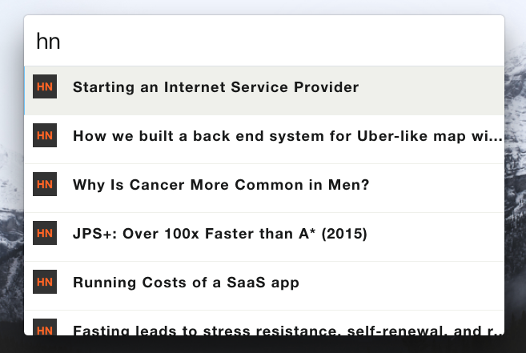

# zazu-hacker-news

[](https://travis-ci.org/chrishelgert/zazu-hacker-news)
[](https://ci.appveyor.com/project/chrishelgert/zazu-hacker-news/branch/master)
[](https://codecov.io/gh/chrishelgert/zazu-hacker-news)
[](https://standardjs.com)
[](https://greenkeeper.io/)

> A [Zazu](https://github.com/tinytacoteam/zazu) plugin for listing the lastest [Hacker News](https://news.ycombinator.com/)

## Usage

Simple type in `hn` and you will get the latest Hacker-News listed.



## Install

Add `chrishelgert/zazu-hacker-news` to your plugins block inside your `.zazurc.json` file.

```json
{
  "plugins": ["chrishelgert/zazu-hacker-news"]
}
```

## Contributing

1. Fork it
2. Create your feature branch
3. Commit your changes
4. Push to the branch
5. Create new Pull Request

## LICENSE

Copyright (c) 2017 Chris Helgert. See [License](./LICENSE) for details.
